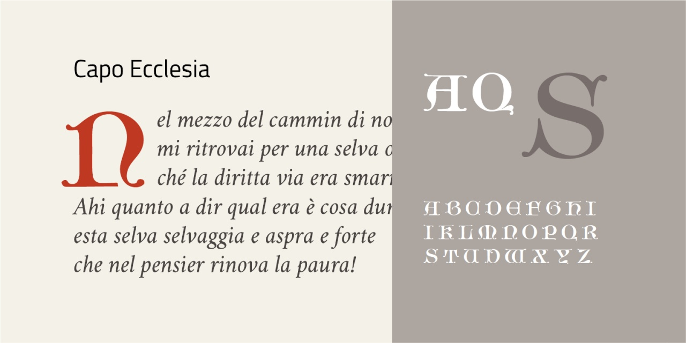

# Capo Ecclesia
* Versione 1.0: versione iniziale

Per testare il font, vedere la [pagina interattiva](https://m-casanova.github.io/CapoEcclesia/).

## Descrizione

Il font _Capo Ecclesia_ è basato sulle maiuscole del carattere _Altgotische Kirchenschrift_ pubblicato da Eric-Jean Müller in _[50 Alphabete für Techniker und Fachschulen](https://luc.devroye.org/fonts-97350.html)_.

